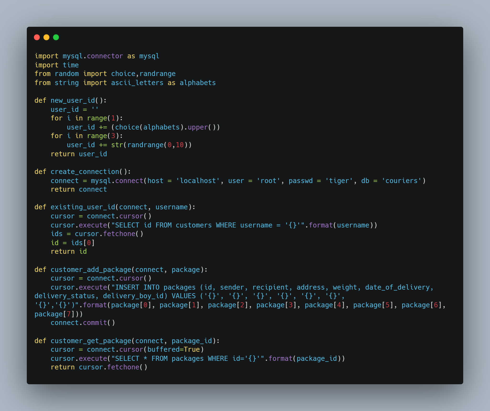
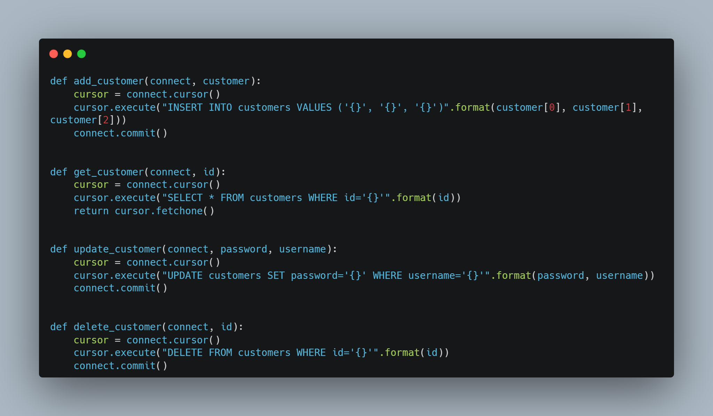
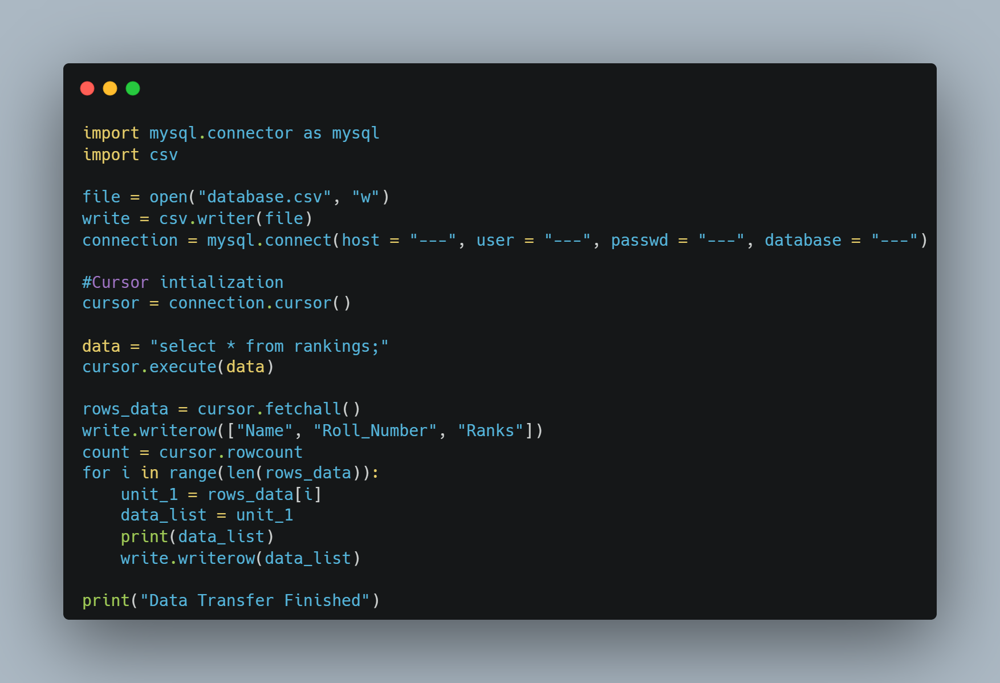
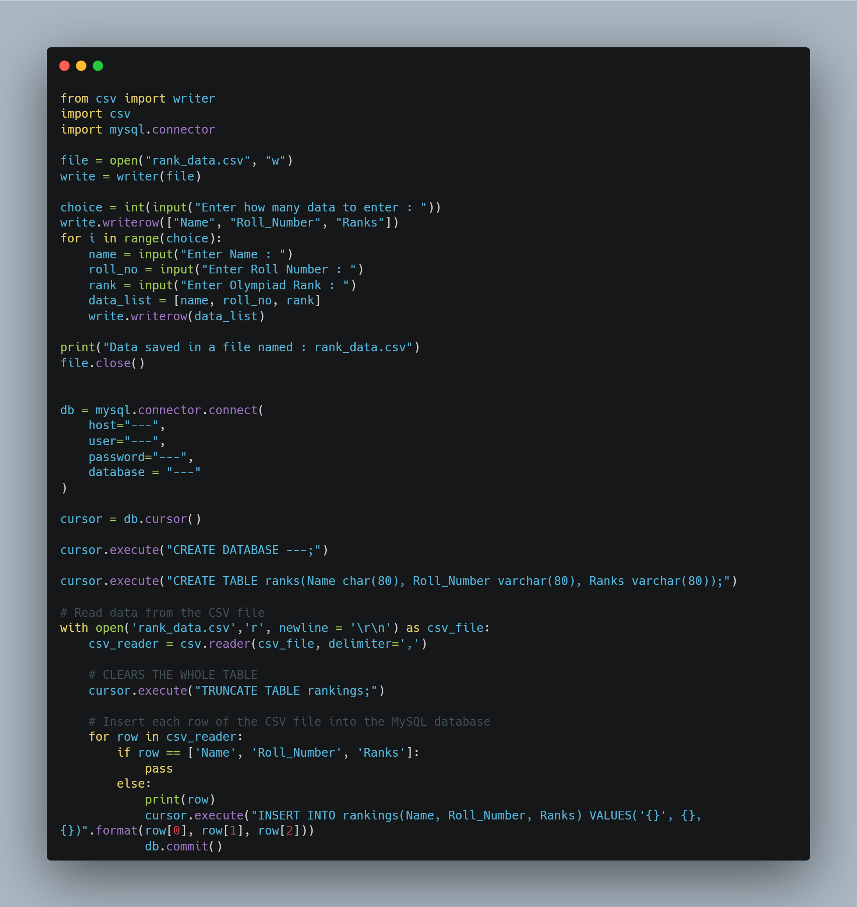

<!DOCTYPE html>
<html lang="en">
<head>
    <meta charset="UTF-8">
    <meta name="viewport" content="width=device-width, initial-scale=1.0">
    <link rel="stylesheet" href="style.css">
</head>
<body>
    <h1 id="hi">Hi there 🙏</h1>
    

    <h2 id="greet">Welcome to my realm 🧑‍💻</h2>
    <h3 id="me">About My Coding Skills</h3>
    <ul>
        <li>Learning Frontend</li>
        <li>I am currently working to recreate a game using IP of another game</li>
        <li>Self taugth Python programmer</li>
        <li>Python Libraries I know</li>
        <ol>
            <li>CSV</li>
            <li>Pickle</li>
            <li>Mysql.connector</li>
            <li>Pandas</li>
            <li>Numpy</li>
            <li>Matplotlib</li>
        </ol>
    </ul>
    

    <h3 id="me">About My Personally</h3>
    <ul>
        <li>I have a really bad habit of overcomplicating stuff (it sometimes show up in my programs too 😅)</li>
        <li>I love reading books especially Science Fiction genres</li>
        <li>I am always excited to learn about new things which I have no idea about</li>
    </ul>
    

    <h3>Glimpses of my Programs</h3>
    <ol>
        <li>Courier-Delivery-Database-System</li>
             
            
            
             
            

        <li>CSV to Mysql and vice-versa</li>
             
            
            
    </ol>
</body>
</html>